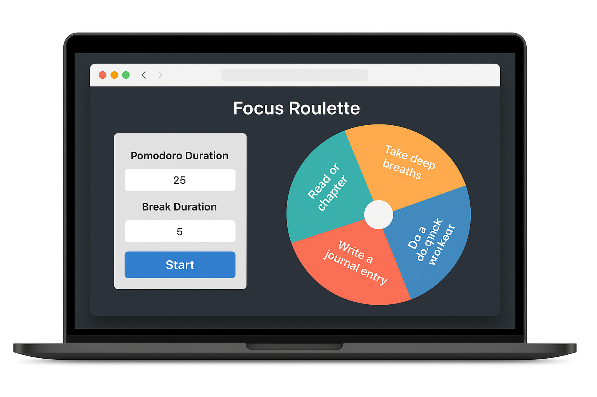

# Freelancer Portfolio Website

A personal portfolio website built with **HTML**, **Tailwind CSS**, and **JavaScript** to showcase my skills and projects as a frontend developer.

## 🌐 Live Demo

👉 [View Website](https://mbasaahla.github.io/freelancer-portfolio/)

## ✨ Features

- Fully responsive design for all devices
- Clean and modern UI using Tailwind CSS
- Portfolio section showcasing my featured project: **Focus Roulette**
- Functional contact form powered by [Formspree](https://formspree.io)
- Dark mode toggle for better accessibility

## 🛠️ Built With

- HTML5
- Tailwind CSS
- JavaScript
- Formspree (for contact form integration)
- AOS (Animate on Scroll)

## 📬 Contact

Feel free to reach out via the contact form on the site or email me directly at:

**Mbasabacela.bacela2@email.com**

---

## 📁 Folder Structure

## 📌 Author

**Mbasa Ahla Bacela**  
Frontend Developer & UI/UX Enthusiast  
South Africa

---

